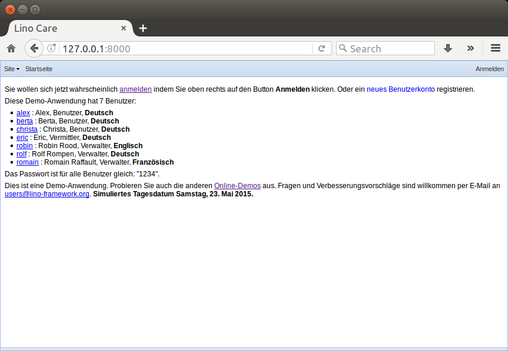
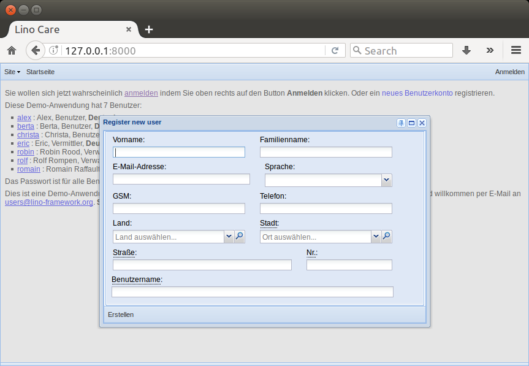
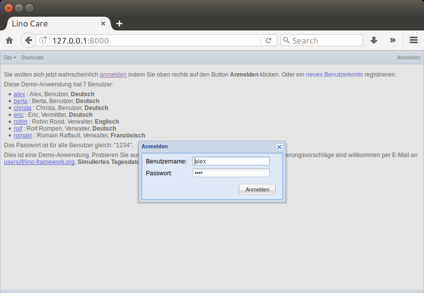
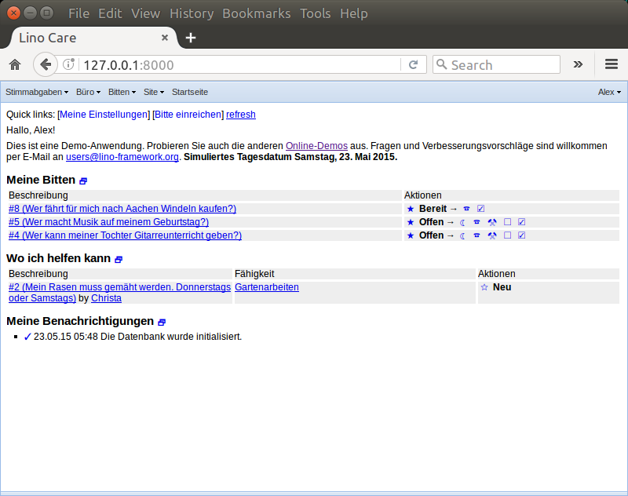
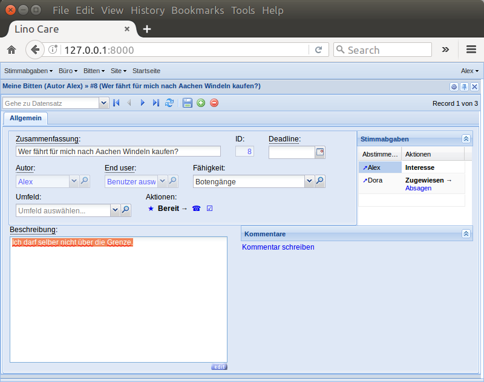
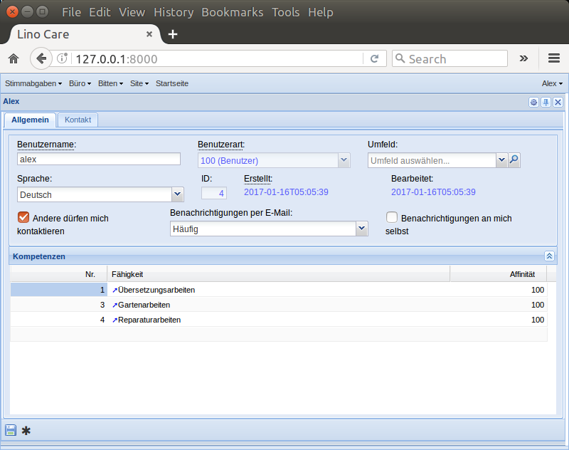
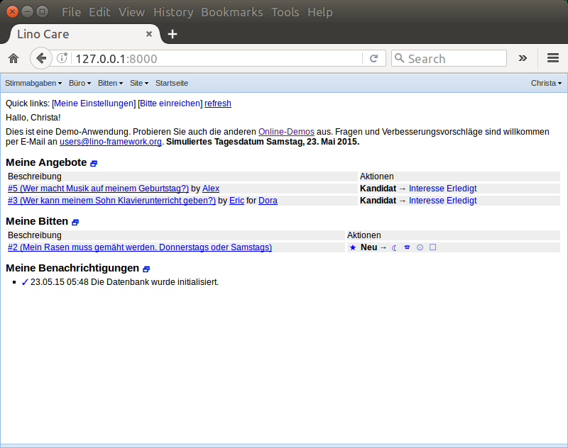
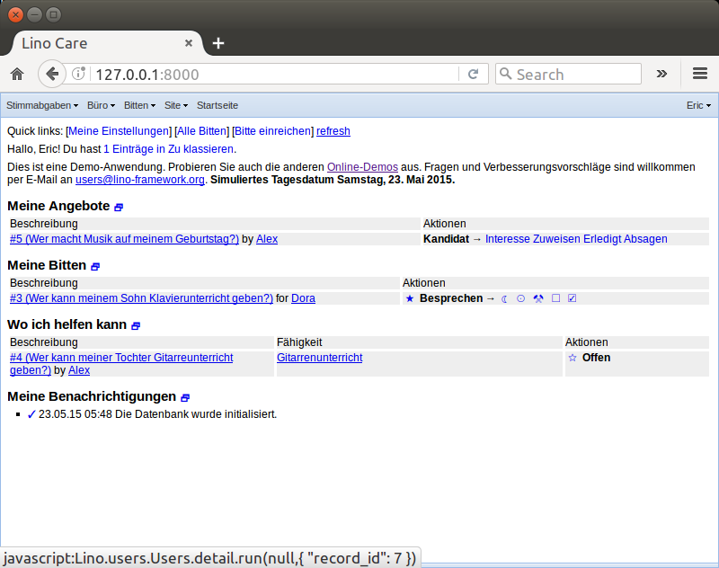

.. _care.tour.de:

=====================
Schnellkurs Lino Care
=====================

Die Demo-Datenbank
==================

Es gibt eine Datenbank mit fiktiven Daten und Benutzern, die wir in
diesem Dokument benutzen werden.

Die *echte* Datenbank steht momentan unter https://oikos.mylino.net

Diese Adresse könnte sich noch ändern. Außerdem ist Lino Care nicht
nur für dieses Projekt geschrieben worden, könnte also in Zukunft auch
an anderen Stellen laufen.

Um in der Datenbank zu arbeiten, musst du dich *anmelden*.  Du selbst
hast vielleicht schon deinen Benutzernamen und Passwort
bekommen. Falls nicht, kannst du dich registrieren.

Alex
====

Der erste Demo-Benutzer, den wir hier vorstellen möchten, ist Alex.

Alex ist offenbar musikalisch interessiert, denn er hat zwei Bitten in
diesem Bereich. Auch ist er offenbar vor kurzem Vater geworden und
möchte Windeln in Aachen kaufen.  Wie jeder weiß, sind Windeln in
Aachen deutlich billiger als in Eupen.  Andererseits macht Lino ihm
einen Vorschlag, wie er sich engagieren kann, nämlich zum Rasenmähen.

Schauen wir uns seine Bitte mit den Windeln mal genauer an. Hier
erfahren wir mehr über die Anfrage, denn Alex hatte in der
Beschreibung hinzugefügt "Ich darf selber nicht über die Grenze."

Außerdem sehen wir zwei sogenannte **Stimmabgaben**. Das ist die Liste
der Benutzer, die sich zu dieser Bitte geäußert haben.  Es gibt deren
zwei.  Erstens steht da der Alex selber.  Wir sehen eine Kolonne mit
dem Titel **Aktionen**. Bei Alex steht dort "Interesse" und ansonsten
nichts. Ja, als Autor ist es logisch, dass er sich für seine Bitte
zumindest interessiert.

Außerdem steht dort eine Dora, und die hat in "Aktionen" stehen:
**Zugewiesen** --> **Absagen**.  Das bedeutet, dass Alex irgendwann
seine Bitte der Dora zugewiesen hat. Also dass Dora sozusagen den
Auftrag bekommen hat.

.. `Arbeitsablauf <https://de.wikipedia.org/wiki/Arbeitsablauf>`__

           

Die Bitte ist im Status **Bereit**. Das heißt, dass sie ausgeführt
wurde und lediglich noch auf Alex' Bestätigung wartet. Bewertung

            
Lino kennt deine Kompetenzen
============================

Wie wir sahen, macht Lino Alex den Vorschlag, sich zum Rasenmähen bei
Christa zu melden.

Dass Alex Rasen mähen kann, weiß Lino, weil Alex es ihm gesagt hat.
Jeder Benutzer hat nämlich eine Liste von **Kompetenzen**
(Fähigkeiten). Diese Liste kann jeder selber eingeben in seinen
**Einstellungen**. Für jede Kompetenz kann man dort außerdem eine
**Affinität** angeben, d.h. eine Bewertung von 1 bis 100), wie gerne
du das machst.
           

Berta
=====

.. image:: 5.png
    :alt: Hauptbildschirm Berta
    :width: 400
           

           

           
